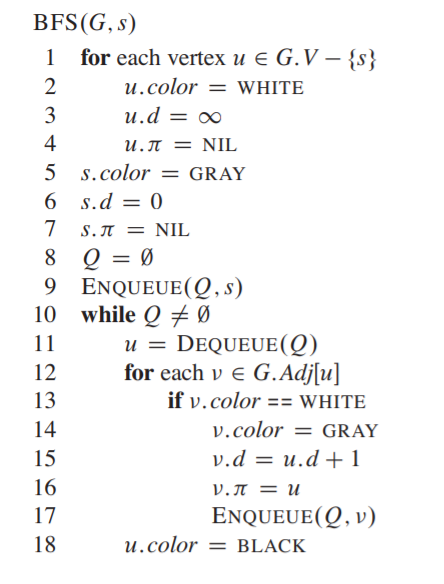
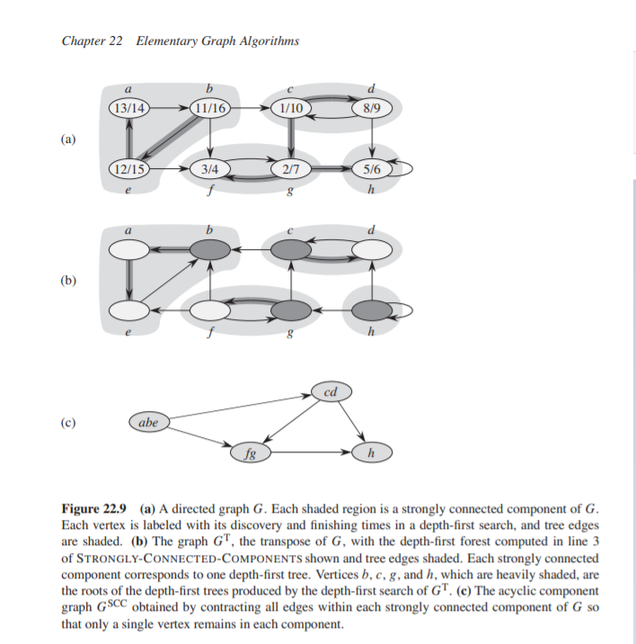

# 22. Elementary Graph Algorithms.  
This chapter presents methods for representing a graph and for seraching a graph.  
Because, it is something we learnt before, I will not go through details in this chapters.  
## 22.1. Representations of graphs.  
We can choose between two standard ways to represent a graph G = (V,E).  
+ as a collection of adjacency lists.  
+ adjacency matrix.  
Because the adjacency-list provides a compact way to represent **sparse** graph, it is the most prevalent method today.  
## 22.2. Breadth-first search.  
**Breadth-first search** is one of the simplest algorithms for searching a graph and  the archetype for many important algorithms. Because, it reaches nodes as their "levels" increases, BFS often used in finding shortest path.  
Source code:

.  

## 22.3. Depth-first search.  
Different with BFS, the strategy in DFS is, to search deeper in the graph whenever possible.  
DFS in finding bridges.  
```
int low[N], num[N];
vector < vector<int> > G;
bool ok[N];
int khop, cau, n, m;
void dfs(int u,int pre){
    low[u] = num[u] = ++cnt;
    int chid = 0;
    for(int i=0;i<G[u].size();++i){ int v = G[u][i]; if (v == pre) continue;
        if (num[v]) low[u] = min(low[u], num[v]);
            else {
                chid++;
                dfs(v,u); low[u] = min(low[u], low[v]);
                if (low[v] >= num[v])  cau++;
                if (low[v] >= num[u] && u != pre) ok[u] = 1; 
            }
        }
        if (u == pre && chid >= 2) ok[u] = 1;
    }
```  

## 22.4. Topological sort.  
This section shows how we can use DFS to perform a topological sort of a directed acyclic graph, or a "DAG" as it is sometimes called. A **topological sort** of a a dag G = (V,E) is a linear ordering of all its vertices such that if G contains a edge (u,v) then u appears before v in the ordering. (If graph contain a cycle then no linear ordering is possible).  
We can perform **topological sort** in a simple algorithm using DFS.  
```
TOPOLOGICAL_SORT(G):
call DFS(G) to compute finishing times v.f for each vertex v.  
as each vertex is finished, insert it onto the front of a linked list.  
return the linked list of vertices.  
```  
We can perform this algorithm in O(|V| + |E|).  
It is worth to notice that a directed graph G is acyclic if and only if a DFS search of yields no backs edges.  
**Note:** We also perform an BFS or Djikstra-like algorithm to find Toposort. For example, in Kahn's algorithm, his goal is finding the "start nodes" - a node s which have no incomming edges and insert them into answer set, and delete node s.  
Below is my code for [TOPOSORT](https://www.spoj.com/problems/TOPOSORT/) problem to find smallest topological sort order. It works well with priority_queue to find the answer.  
```
void solve(){
	priority_queue< pr, vector<pr>, greater<pr> > pq;
	for(int i=1;i<=n;++i) pq.push(pr(d[i],i));
	while (pq.size()){
		pr u = pq.top(); pq.pop();
		if (d[u.second] != u.first) continue;
		if (!u.first) {
			topo.push_back(u.second);
			for(auto v : G[u.second]){
				d[v]--;
				pq.push(pr(d[v],v));
			}
		}
	}
	if (topo.size() != n) cout << "Sandro fails.";
	else {
		for(auto v: topo) cout << v << ' ';
	}
}
```  
[**Source code**](./TOPOSORT.cpp)
## 22.5 Strongly connected components.  
We now consider a classic application of deph-first search: decomposing a directed graph into its strongly connected components.  
Recall prom Appendix B that a strongly connected component of a directed graph G = (V,E) is a maximal set of vertices $C \in V$ such that for every pair of vertices u and v in C, we have both the roads from u to v, and from v to u. Figure 22.9 shows an example.  

  

**Note:** Instead of showing the original algorithms for finding Strongly connected components in Introduction to Algorithm, I will recommend about Tarjan algorithm for finding strongly connected components.  
```
void dfs(int u,int pre){
    visted_node.push_back(u);
    low[u] = num[u] = ++cnt;
    for(int i=0;i<G[u].size();++i){int v = G[u][i]; if (v == pre) continue;
        if (num[v]) low[u] = min(low[u], num[v]);
            else {
                dfs(v,u); low[u] = min(low[u], low[v]);
            }
    }
    if (low[u] == num[u]){
        scc++;
        while (visted_node.back() != u){
            low[visted_node.back()] = num[visted_node.back()] = INF;
            visted_node.pop_back();
        }
        low[u] = num[ad.back()] = INF;  ad.pop_back();
    }
}
```  
In this source code, during DFS, I maintain two variables for each node u: low[u] and num[u].  
+ num[u]: is the order of nodes in which the order they are discovered in the dfs.  
+ low[u]: represents the smallest index of any node known to be reachable from u through u's DFS subtree, including v itself.  
If u is the root of an SCC(strongly connected components) then low[u] must equal to u.  
+ Besides, visited_node is an vector/ stack to maintain all the visited node according to DFS order.
``` 
  while (visted_node.back() != u){
            low[visted_node.back()] = num[visted_node.back()] = INF;
            visted_node.pop_back();
        }
        low[u] = num[ad.back()] = INF;  ad.pop_back();
```  
When you find a scc and its root (node u), you need to remove the scc connected from the graph by assigning low[v] = num[v] = INF for each member of this strongly connected components.  
You can submit the code in [here](https://vn.spoj.com/problems/TJALG/)  
[**Source code**](./TARJAN.cpp)  
Also, you can use Tarjan algorithm to find all of the bridges and joints in a graph.  
A bridge is a edge (u,v) that if you remove it, the number of strongly connected components will be increased.  
Similarly, a joint is a node that if you remove it, the number of strongly connected components will be increased.  
```
void dfs(int u,int pre){
    low[u] = num[u] = ++cnt;
    int chid = 0;
    for(int i=0;i<G[u].size();++i){ int v = G[u][i]; if (v == pre) continue;
        if (num[v]) low[u] = min(low[u], num[v]);
            else {
                chid++;
                dfs(v,u); low[u] = min(low[u], low[v]);
                if (low[v] >= num[v])  cau++;
                if (low[v] >= num[u] && u != pre) ok[u] = 1; 
            }
        }
        if (u == pre && chid >= 2) ok[u] = 1;
    }
```
In the above code, I maintain ok[u] to check that if node u is a joint or not.  
An edge (u,v) (u is the father in DFS order) is a bridge if and only if (low[v] >= num[u]) it means that if you try to delete edge (u,v), then node v cannot connect with the node u anymore (because it cannot reach to the node which is discovered before u).  
Similarly, a node u is a joint, if:
+ It is the root of the tree and have at least two child.  
+ or It has at least one node v, and edge (u,v) is a bridge.  

You can submit your code [here](https://vn.spoj.com/problems/GRAPH_/)  

[**Source code**](./GRAPH.cpp)  

## LCA(Lowest Common Ancestor)  
Source code:
```
int lca(int u,int v){
    if (level[u] < level[v]) swap(u,v);
    for(int i=logN-1;i>=0;--i) if (level[u] - (1 << i) >= level[v]) u = par[u][i];
    if (u == v) return u;
    for(int i=logN-1;i>=0;--i) if (par[u][i] != -1 && par[u][i] != par[v][i]) u = par[u][i], v = par[v][i];
    return par[u][0];
}
void prep(int u,int preU){
    par[u][0] = preU;
    if (preU != -1) level[u] = level[preU] + 1;
    for (auto node : G[u]){ 
        if (node.adj == preU) continue;
        prep(node.adj, u);
    }
}
```  
## Euler Tour  
Source code:
```
void dfs(int u,int pre){
    le[u] = ++cnt;
    c[le[u]] = color[u];
    for (auto v : G[u]){
        if (v == pre) continue;
        dfs(v, u);
    }
    ri[u] = cnt;
}
```  
## Eulerian path  
A Eulerian path is a path in a graph that passes through all of its edges exactly once. A Eulerian cycle is a Eulerian path that is a cycle.  
The problem is to find the Eulerian path in an undirected multigraph with loops.   
```
stack St;
put start vertex in St;
until St is empty
  let V be the value at the top of St;
  if degree(V) = 0, then
    add V to the answer;
    remove V from the top of St;
  otherwise
    find any edge coming out of V;
    remove it from the graph;
    put the second end of this edge in St;
```  
First we can check if there is an Eulerian path. We can use the following theorem. An Eulerian cycle exists if and only if the degrees of all vertices are even. And an Eulerian path exists if and only if the number of vertices with odd degrees is two (or zero, in the case of the existence of a Eulerian cycle).  
In addition, of course, the graph must be sufficiently connected (i.e., if you remove all isolated vertices from it, you should get a connected graph).


