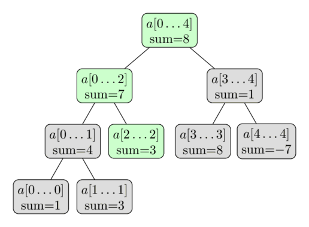

# Segment Tree  
Segment Tree is a tree to help you to "querry" in segment in O(log(n)), instead of O(n).  
This blog takes inspiration from [cp-algorithm website](https://cp-algorithms.com/data_structures/segment_tree.html#counting-zero-search-kth)  

    
## **Basic operations**  
**Init procedure:**  
We often need upto 4*N nodes to cover a n-length segment.  
```
int seg[4*N], lazy[4*N];
```
**LAZY procedure:**    
```
void lazy_upd(int u,int l,int r){
	seg[u] += lazy[u];
	if (l != r) {
		lazy[u*2] += lazy[u];
		lazy[u*2+1] += lazy[u];
	}
	lazy[u] = 0;
}
```
**UPDATE procedure:**  

```
void upd(int u,int L,int R,int l,int r,int d){
	//lazy_upd(u,L,R);
	if (L > R || L > r || R < l) return; 
	if (l <= L && R <= r) {
		lazy[u] = d;
		lazy_upd(u,L,R);
	}
	else {
		upd(u*2,L,MID,l,r,d);
		upd(u*2+1,MID+1,R,l,r,d);
		seg[u] = max(seg[u*2], seg[u*2 + 1]);
	}
}
```  
**Build tree**  
Suppose we have to build a tree that save the maximum value of segments from an array a[].  
```
void build(int u,int l,int r){
    if (l == r){
        seg[u] = a[l];
    }
    else{
        build(u*2,l,mid);
        build(u*2+1,mid+1,r);
        seg[u] = max(seg[u*2], seg[u*2+1]);
    }
}
```
## Persistent Segment Tree  
What if when N is really large but we never use all of the node we created ?  
All we need is to build a persistent tree.  

## Exercise:  
### 1. **[QMAX SPOJ](https://vn.spoj.com/problems/QMAX/)**  
**Problem statement:**  
> Given n elements, m updates, and q questions:  
Each update requires three numbers: (l,r,d) which means increase all the value of segment (l,r) to d.  
Each question has ask you to answer the maximum value of the segment (l,r)  
**Solution:**  
You can use LAZY update to get over the situation.  
### 2. **[KQUERY SPOJ](https://vn.spoj.com/problems/KQUERY/)**  
[Source code](./KQUERY.cpp)
